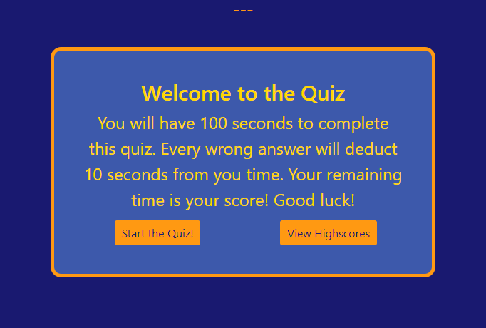
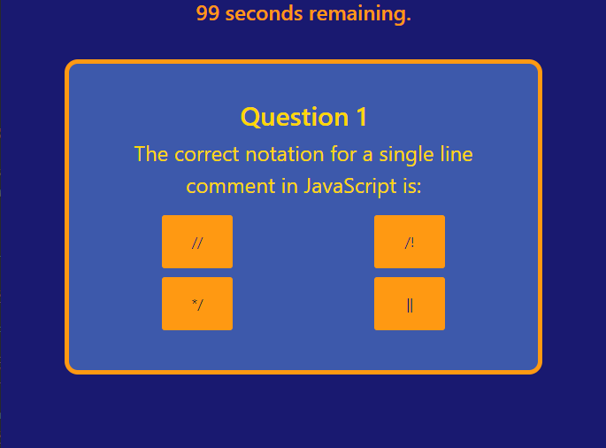
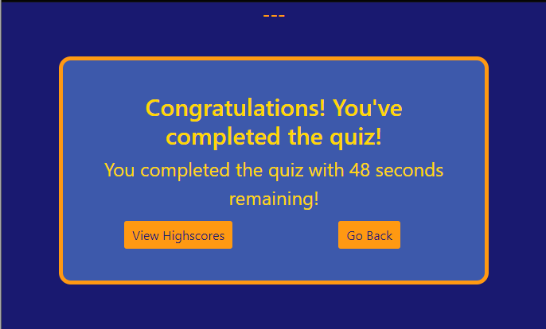
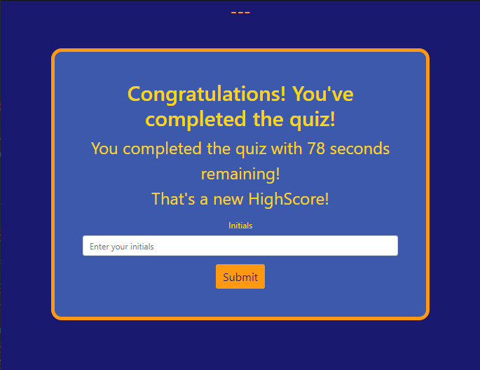
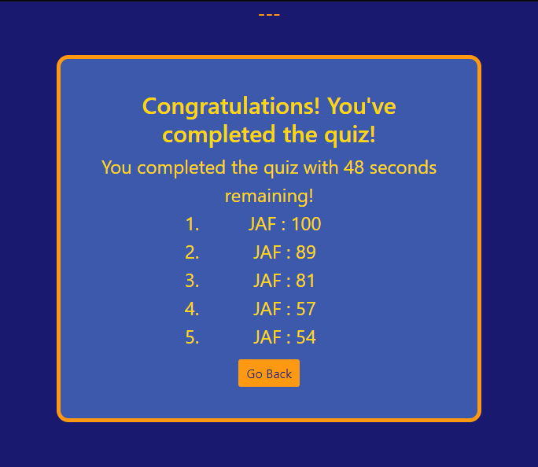
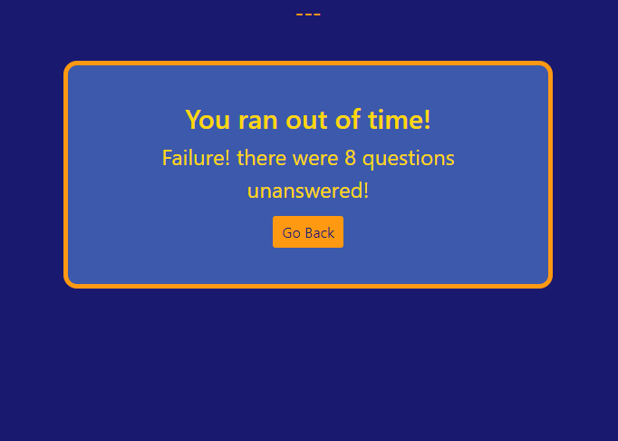

# QUIZ-TIME

## About this page

This is a short quiz of questions related to using javascript in web development.  The quiz is timed and will save times with initials locally with a JSON object.

site is deployed at: [quiz-time](http://www.jacobaf.com/quiz-time/)

## Features

* Responsive design powered by [Bootstrap](http://getbootstrap.com).
* A timer starts when the start button is pressed and questions and answers replace the original header, text, and buttons
* Questions are stored separately in a JSON file for easy loading and modularity. 
* Questions are presented in a random order, with the answers also presented in random order to prevent a user from memorizing their placement.
* Each incorrect answer selected will deduct 10 seconds from the timer, and disables the corresponding button.
* When all question are answered or the timer reaches 0, the appropriate game ending occurs: highscore, no highscore, or failure.
* The top 5 scores are displayable, and user will be prompted to add their initials if they finish the quiz fast enough.

## Potential Improvements

* more questions
* selection between different question sets
* ~~special formatting for code snippets~~
* server side storage for highscores

## Contents

* index.html
* README.md
* LICENSE
* (assets)
    * script.js
    * style.css
    * the-quiz.json
    * (screenshots)

## Usage

#### Welcome Screen

#### Questions

#### No Highscore

#### New Highscore

#### Highscores

#### Failure

## Credits

A thank you forever for reference material at [MDN](https://developer.mozilla.org/en-US/), [w3 Schools](http://w3schools.com), and [Stack Overflow](https://stackoverflow.com/). The method for adding highscores was learned from [this video](https://youtu.be/DFhmNLKwwGw) and the idea to store the quiz in a JSON file was inspired by [this video](https://youtu.be/jK5zzSA2JHI) - both videos coming from a tutorial by [James Quick](https://www.jamesqquick.com/).  All other components of this web application were developed independently.

## License

This website is licensed under the MIT license, copyright 2020